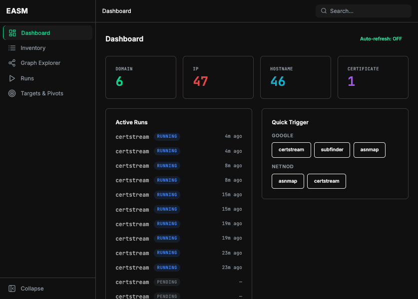
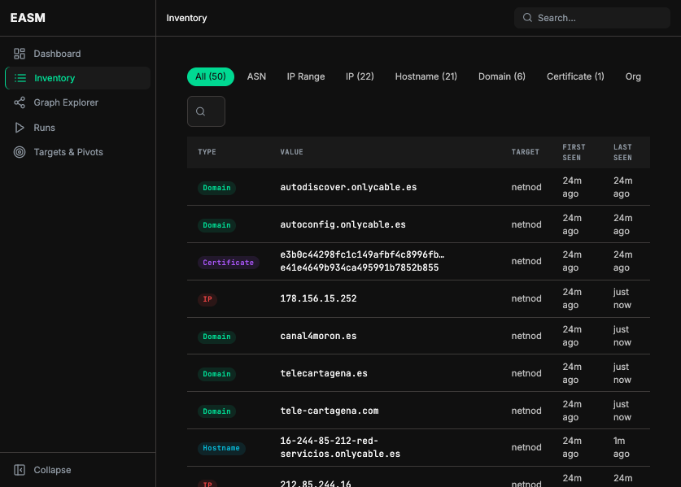
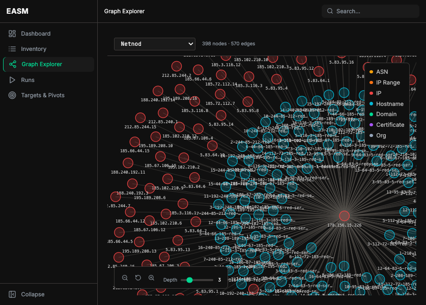
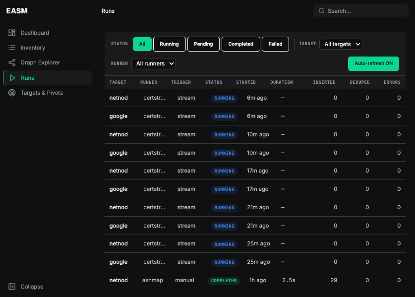
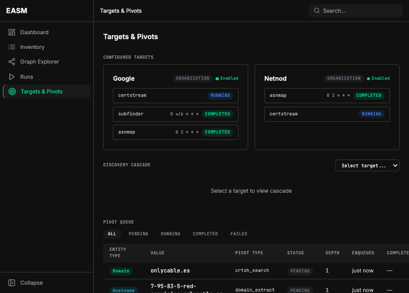

# Open EASM

Self-hosted passive External Attack Surface Management platform. Starts from your ASNs, domains, and keywords, then continuously discovers and maps your entire internet-facing footprint through automated reconnaissance, pivot chaining, and threat intelligence enrichment — all without sending a single packet to your targets.



## Features

### Discovery & Reconnaissance
- **18 Discovery Runners** — ASN enumeration, subdomain discovery, certificate transparency monitoring, cloud bucket enumeration, port scanning, technology fingerprinting, vulnerability scanning, and more. All passive or opt-in active.
- **Automated Pivot Chaining** — Start from an ASN. Open EASM chains pivots automatically: ASN → IP ranges → reverse DNS → hostnames → domain extraction → certificate search → new domains → repeat up to configurable depth.
- **Real-time Certificate Transparency** — Watches the Certificate Transparency log feed via certstream and matches against your configured domains and keywords in real time.
- **Cron-Based Scheduling** — Configure independent cron schedules per runner per target. Trigger any runner on-demand from the UI.

### Enrichment & Intelligence
- **Deep Enrichment Pipeline** — 18 enrichment handlers that pivot from discovered entities to gather: TLS certificate details, DNS mail records (MX/SPF/DMARC), Geo-IP location, RDAP WHOIS data, reverse WHOIS, passive DNS history, and more.
- **Threat Intelligence Integration** — Shodan, AbuseIPDB, GreyNoise, URLScan, and Censys enrichment for IPs and domains.
- **Subdomain Takeover Detection** — Fingerprint-based detection for 10+ common takeover-vulnerable services (GitHub Pages, Heroku, AWS S3, Azure, Netlify, etc.).

### Exposure Monitoring
- **Pastebin & Code Repository Monitoring** — Scrapes Pastebin and monitors GitHub Gists for credential leaks and keyword matches.
- **Breach Database Monitoring** — Checks Have I Been Pwned and Dehashed for organization emails and domains appearing in breach data.
- **GitHub Secret Scanning** — Runs Gitleaks and GitHub code search to find exposed secrets, API keys, and credentials.
- **Discussion Forum Monitoring** — Monitors Stack Overflow and Discord for mentions of your organization or domains.
- **Search Engine Discovery** — Queries DuckDuckGo and other search engines for subdomains and references to your organization.

### Correlation & Alerting
- **YAML-Based Correlation Engine** — Define detection rules as YAML files. 7 built-in rules: cloud bucket exposure, dev/test systems on public internet, email in breach data, high-risk ports exposed, assets in unexpected countries, stale certificates, and subdomain takeover risk.
- **Alert Feed** — Browse, filter, and acknowledge correlation findings. Severity-ranked with entity links.
- **Configurable Alert Rules** — Define custom alert conditions in `config.yaml` with severity levels.

### Visualization & UI
- **D3-force Graph Explorer** — Interactive force-directed graph visualization of your entire attack surface, with entity-type coloring, zoom/pan, and depth controls.
- **Geo Map** — Geographic visualization of discovered IPs with Geo-IP enrichment data.
- **Entity Inventory** — Browse all discovered entities with type-based filtering (ASN, IP Range, IP, Hostname, Domain, Certificate, Org), cursor-based pagination.
- **Run Tracking** — Monitor scheduled and on-demand runner executions with status, timing, entity counts, and auto-refresh.
- **Config Editor** — Edit your `config.yaml` directly from the web UI with validation and config history.
- **Dark Terminal-Inspired Design** — Near-black canvas with electric-teal accents and entity-type color coding.

### Operations
- **Single Binary Deploy** — Multi-stage Dockerfile builds the React SPA and Python backend into one container.
- **Config Hot-Reload** — Update targets and runner config without restarting.
- **Garbage Collection** — Automatic cleanup of old raw events and runs.

## Screenshots

| Dashboard | Inventory |
|-----------|-----------|
|  |  |

| Graph Explorer | Runs |
|---------------|------|
|  |  |

| Targets & Pivots | Alerts |
|------------------|--------|
|  | *Alert feed with correlation findings* |

## Quick Start

### Requirements

- Docker & Docker Compose
- (Optional) [PDCP API key](https://cloud.projectdiscovery.io) for asnmap — free tier available
- (Optional) API keys for enrichment: Shodan, AbuseIPDB, GreyNoise, Censys, SecurityTrails, HIBP, Dehashed, GitHub, Pastebin

### Setup

```bash
# 1. Clone the repo
git clone https://github.com/zarguell/open-easm.git
cd open-easm

# 2. Configure environment
cp .env.example .env
# Edit .env if you want to change the default DB credentials

# 3. Configure your targets
cp config.yaml.example config.yaml
# Edit config.yaml with your organization's ASNs, domains, and keywords

# 4. Start
docker compose up -d

# 5. Open the UI
open http://localhost:8000/ui
```

The API is available at `http://localhost:8000/api` with interactive docs at `http://localhost:8000/docs`.

## Configuration

Targets are defined in `config.yaml`. Each target specifies what to discover and how:

```yaml
targets:
  - id: my-org
    name: My Organization
    type: organization
    enabled: true
    labels:
      env: prod
      owner: security
    match_rules:
      domains:
        - example.com
      keywords:
        - Example Corp
      asns:
        - AS15169
      keyword_patterns:
        - type: email
          pattern: "@example\\.com"
          severity: high
    runners:
      certstream:
        enabled: true
        mode: realtime
      subfinder:
        enabled: true
        schedule: "0 */6 * * *"
      asnmap:
        enabled: true
        schedule: "0 2 * * *"
      paste_monitor:
        enabled: true
        schedule: "*/5 * * * *"
        sources: [pastebin]
      github_scan:
        enabled: true
        schedule: "0 */4 * * *"
        github_token: "${GITHUB_TOKEN}"
      breach_monitor:
        enabled: true
        schedule: "0 6 * * *"
        sources: [hibp]
        hibp_api_key: "${HIBP_API_KEY}"
    pivot:
      enabled: true
      max_depth: 4
      max_concurrent: 3
      allowed_pivots:
        - from: ip_range
          to: ip
          via: reverse_dns
        - from: hostname
          to: ip
          via: dns_resolve
        - from: domain
          to: certificate
          via: crtsh_search
        - from: hostname
          to: certificate
          via: tls_cert_grab
          cooldown_hours: 24
        - from: domain
          to: domain
          via: dns_mail_records
          cooldown_hours: 24
```

See `config.yaml.example` for the full reference with all 18 runners and 18 pivot types.

## Architecture

```
┌──────────────────────────────────────────────────────┐
│                    UI (React 18)                       │
│  Dashboard · Inventory · Graph · Runs · Targets        │
│  Config Editor · Alerts · Geo Map                      │
└──────────────────────┬───────────────────────────────┘
                       │ /api/*
┌──────────────────────┴───────────────────────────────┐
│              FastAPI (Python 3.14)                     │
│  ┌──────────┐ ┌──────────┐ ┌──────────────────────┐  │
│  │ Scheduler │ │  Runners  │ │  Pivot Workers (×3)  │  │
│  │(APScheduler)│ │  (18)    │ │  + Correlation Engine│  │
│  └────┬─────┘ └────┬─────┘ └───────┬──────────────┘  │
│       │            │               │                   │
│  ┌────┴────────────┴───────────────┴──────────────┐   │
│  │              Store (asyncpg)                     │   │
│  └───────────────────┬────────────────────────────┘   │
└──────────────────────┼───────────────────────────────┘
                       │
              ┌────────┴────────┐
              │   PostgreSQL 18  │
              └─────────────────┘
```

### Data Flow

```
Runner → raw_events (audit log) + entities/relationships (inline)
       → Pivot Queue → Enrichment Handlers → new raw_events
       → Correlation Engine → Findings → Alert Feed
```

Entities and relationships are produced inline during discovery runs. Raw events are preserved as an append-only audit log.

## Runners

### Discovery Runners

| Runner | Type | Source | What it discovers |
|--------|------|--------|-------------------|
| **asnmap** | subprocess | ASN | IP ranges belonging to the ASN |
| **subfinder** | subprocess | Domain | Subdomains via passive DNS sources |
| **certstream** | websocket | CT Logs | Domains and certificates in real time |
| **crtsh** | HTTP | crt.sh | Historical certificates for a domain |
| **dnstwist** | subprocess | Domain | Lookalike/phishing domain permutations |
| **cloud_enum** | subprocess | Keywords | Public cloud storage buckets (AWS, GCP, Azure) |
| **commoncrawl** | HTTP | Common Crawl | URLs and subdomains from web archives |
| **searchengine** | HTTP | Search engines | Subdomains and references from DuckDuckGo |
| **wappalyzer** | subprocess | Hostname | Technology stack fingerprinting |
| **portscan** | subprocess | Hostname | Open ports and services via nmap |
| **nuclei** | subprocess | Hostname | Vulnerability scanning with nuclei templates |
| **screenshot** | playwright | Hostname | Homepage screenshots via headless Chrome |

### Exposure Monitoring Runners

| Runner | Type | Source | What it monitors |
|--------|------|--------|------------------|
| **paste_monitor** | HTTP | Pastebin | Credential leaks and keyword matches in pastes |
| **gist_monitor** | HTTP | GitHub Gists | Secrets and keywords in public gists |
| **github_scan** | subprocess+HTTP | GitHub | Gitleaks secret scanning + code search |
| **breach_monitor** | HTTP | HIBP, Dehashed | Organization emails/domains in breach databases |
| **stackoverflow_monitor** | HTTP | Stack Overflow | Organization mentions in questions/answers |
| **discord_monitor** | HTTP | Discord | Organization mentions via webhook/channel monitoring |

### Pivot & Enrichment Handlers

| Handler | Source | What it enriches |
|---------|--------|------------------|
| **reverse_dns** | IP range | Hostnames via reverse DNS |
| **dns_resolve** | Hostname | IP addresses via forward DNS |
| **domain_extract** | Hostname | Registered domain from FQDN |
| **crtsh_search** | Domain | Certificates from crt.sh |
| **dns_mail_records** | Domain | MX, SPF, DMARC records + mail provider |
| **tls_cert_grab** | Hostname | TLS certificate + SAN names |
| **domain_rdap** | Domain | WHOIS registrant, nameservers, dates |
| **geoip_enrich** | IP | Geographic location via MaxMind GeoLite2 |
| **shodan_enrich** | IP | Open ports, vulns, hostnames, ISP |
| **abuseipdb_enrich** | IP | Abuse confidence score, reports |
| **greynoise_enrich** | IP | Internet background noise classification |
| **urlscan_enrich** | Domain | Public scan results, malicious URLs |
| **censys_enrich** | IP | Services, location, ASN data |
| **reverse_whois** | Domain | Related domains by registrant email |
| **passive_dns** | Domain | Historical A records via SecurityTrails |
| **subdomain_takeover** | Hostname | Fingerprint-based takeover risk detection |

## Correlation Rules

Built-in detection rules in `correlations/`:

| Rule | Risk | Description |
|------|------|-------------|
| **cloud_bucket_open** | high | Publicly accessible cloud storage bucket |
| **dev_or_test_system** | medium | Dev/test/staging hostnames on public internet |
| **email_in_breach** | high | Organization email address found in breach data |
| **high_risk_port_exposed** | high | Database/admin ports exposed to internet |
| **outlier_country** | medium | Asset hosted in unexpected geographic location |
| **stale_certificate** | medium | TLS certificate nearing or past expiration |
| **subdomain_takeover_risk** | high | Subdomain pointing to takeover-vulnerable service |

Add your own rules by creating YAML files in the `correlations/` directory.

## API

| Endpoint | Description |
|----------|-------------|
| `GET /api/targets` | List configured targets with runner status |
| `GET /api/targets/{id}` | Single target with full config |
| `GET /api/entities` | Paginated entity inventory with type/source/date filters |
| `GET /api/entities/{id}` | Single entity with relationships |
| `GET /api/graph/{target_id}` | Full graph (nodes + edges) for a target |
| `GET /api/runs` | List runner executions with filters |
| `GET /api/runs/{id}` | Single run with logs and entity counts |
| `POST /api/runs/{target_id}/{runner}` | Trigger a runner on demand |
| `GET /api/pivot-queue` | Pending pivot jobs with status |
| `GET /api/findings` | Correlation findings with risk/status/rule filters |
| `GET /api/findings/{id}` | Single finding detail |
| `PATCH /api/findings/{id}` | Update finding status (open/acknowledged/resolved/false_positive) |
| `GET /api/alerts/rules` | Configured alert rules |
| `GET /api/alerts/feed` | Unacknowledged findings as alert feed |
| `PATCH /api/alerts/feed/{id}` | Acknowledge an alert |
| `GET /api/config` | Current config (read-only) |
| `PUT /api/config` | Update config |
| `POST /api/config/reload` | Hot-reload config from disk |
| `GET /api/config/history` | Config snapshot history |
| `GET /api/healthz` | Health check with binary availability |

Interactive docs available at `http://localhost:8000/docs`.

## Tech Stack

| Layer | Technology |
|-------|-----------|
| Backend | Python 3.14, FastAPI, asyncpg, APScheduler, Pydantic |
| Frontend | React 18, TypeScript, Vite, Tailwind CSS 4 |
| Graph | D3-force |
| Geo Map | MapLibre GL |
| Database | PostgreSQL 18 |
| Discovery Tools | subfinder, asnmap, dnstwist, nuclei, nmap, wappalyzer, gitleaks |
| Enrichment | Shodan, AbuseIPDB, GreyNoise, Censys, SecurityTrails, URLScan, MaxMind GeoLite2 |
| Deploy | Docker multi-stage build (React SPA + Python backend in one container) |

## Development

```bash
# Install dependencies
uv sync

# Run tests
uv run pytest

# Lint
uv run ruff check src/

# Type check
uv run mypy src/

# Run the backend locally
uv run python -m easm.main

# Run the frontend dev server (proxies API to :8000)
cd ui && npm install && npm run dev
```

## License

MIT
